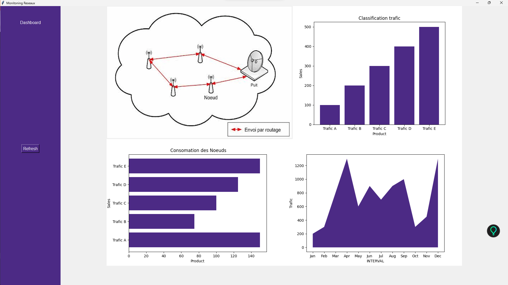

```markdown
# Monitoring Réseaux avec Tkinter et Matplotlib

Ce projet Python utilise la bibliothèque tkinter pour créer une interface graphique et matplotlib pour générer des graphiques représentant différentes données de monitoring réseaux.

## Prérequis

- Python installé sur votre machine
- Les bibliothèques tkinter, PIL (Pillow), et matplotlib installées via pip

## Exécution du programme

1. **Cloner le dépôt :**
   ```
   git clone https://github.com/Mandarahades/simple-Dashboard.git
   ```

2. **Installer les dépendances :**
   ```
   pip install tkinter pillow matplotlib
   ```

3. **Exécuter l'application :**
   ```
   python monitoring_reseaux.py
   ```

## Fonctionnement

Le fichier `monitoring_reseaux.py` est le fichier principal de l'application. Il crée une interface graphique avec tkinter et utilise matplotlib pour générer différents types de graphiques représentant des données de monitoring réseaux.

### Structure du Code

- Les données des graphiques sont définies dans les fichiers `data.py`.
- La fenêtre principale de l'application est créée avec tkinter.
- Différents graphiques sont générés à l'aide de matplotlib et intégrés dans la fenêtre tkinter.

### Interface Utilisateur

L'interface utilisateur comprend :
- Un cadre latéral avec des boutons pour interagir avec les graphiques.
- Des cadres pour afficher différents graphiques générés.

## Fonctionnalités

- Affichage de différents types de graphiques de monitoring réseaux.
- Possibilité de rafraîchir les graphiques en utilisant le bouton "Refresh".
```

## Implémentation

Voici une capture d'écran représentant l'implémentation de l'application :



## Fonctionnement

Le fichier `monitoring_reseaux.py` est le fichier principal de l'application. Il crée une interface graphique avec tkinter et utilise matplotlib pour générer différents types de graphiques représentant des données de monitoring réseaux.

### Structure du Code

...

